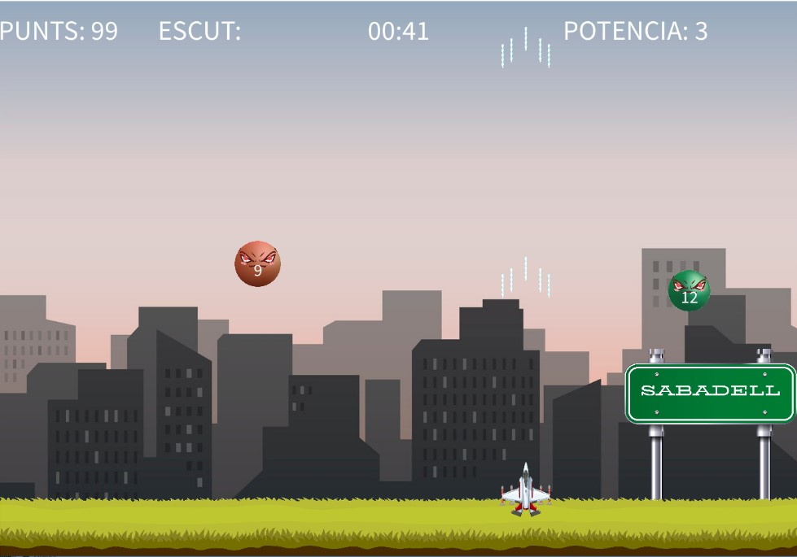

<h1 align="center">  🚀 Balistic Blaster: Un Juego de Física y Programación Creativa </h1>
<div align="center">
  
</div>
<h2> 📝 Descripción del Proyecto </h2>
<P align="justify">Balistic Blaster es un videojuego arcade dinámico desarrollado en Processing como proyecto final para la asignatura de Programación Creativa. Este título te sumerge en una experiencia donde pilotas una nave espacial con el objetivo de destruir una serie de pelotas que rebotan por la pantalla, cada una con un nivel de "dureza" único que determina la cantidad de impactos necesarios para su eliminación.</P>
<P align="justify">El juego fue diseñado para explorar la programación como una herramienta para la creación de sistemas interactivos y originales. Se puso un énfasis especial en la simulación de físicas realistas para los rebotes y las interacciones, aplicando directamente los principios de interactividad avanzada y emergencia abordados en la asignatura. Además, la aparición de ayudas aleatorias (power-ups) añade una capa estratégica y de serendipidad a cada partida.</P>
<h2>✨ Características Principales</h2>
<ul>
  <li><strong>Mecánicas de Rebotar y Disparar:</strong> Controla una nave espacial para interactuar con y eliminar pelotas dinámicas.</li>
  <li><strong>Física Realista:</strong> Implementación detallada de la física para rebotes auténticos y comportamiento de las pelotas.</li>
  <li><strong>Variedad de Pelotas:</strong> Diferentes niveles de "dureza" para un desafío progresivo.</li>
  <li><strong>Power-ups Dinámicos:</strong> Ayudas aleatorias que aparecen en pantalla para mejorar tu experiencia de juego.</li>
  <li><strong>Desarrollado en Processing:</strong>Un ejemplo práctico de programación creativa y diseño de sistemas interactivos.</li>
</ul>
<h2>🛠️ Tecnologías Utilizadas</h2>
<p>Processing</p>
<h2> 👤 Autor </h2> 
<P>Marc Ripoll Fàbrega</P>
www.linkedin.com/in/marcripollfàbrega
<h2> 🎮 Ver el Proyecto en Acción </h2>
<p>Puedes ver un vídeo del gameplay aquí:</p>
https://youtu.be/VoQNfzLdolU

<h2> ⚖️ Licencia </h2>
<p>Este proyecto está bajo una licencia que prohíbe su uso comercial.</p>

<h2>📦 Cómo Instalar y Ejecutar</h2>
Para poner en marcha Balistic Blaster, sigue estos sencillos pasos:

1.  **Asegúrate de tener Processing instalado:**
    * Si no lo tienes, descárgalo de la [página oficial de Processing](https://processing.org/download/).

2.  **Clona el repositorio:**
    ```bash
    git clone [https://github.com/tu-usuario/nombre-de-tu-repositorio.git](https://github.com/tu-usuario/nombre-de-tu-repositorio.git)
    ```
    (Reemplaza `tu-usuario/nombre-de-tu-repositorio` con la URL real de tu repositorio.)

3.  **Abre el proyecto en Processing:**
    * Navega hasta la carpeta `BalisticBlaster` (o el nombre de tu sketch principal) dentro del repositorio clonado.
    * Abre el archivo `.pde` principal del juego con el entorno de Processing.

4.  **Ejecuta el juego:**
    * Una vez abierto en Processing, haz clic en el botón "Run" (el triángulo ►) para iniciar el juego.
<h2>🕹️ Controles del Juego</h2>
<ul>
  <li><strong>Movimiento de la Nave:</strong> Teclas de flecha izquierda (◀) y derecha (▶)</li>
  <li><strong>Disparar:</strong> Barra espaciadora</li>
</ul>
<h2>🙏 Créditos</h2>
<ul>
  <li><strong>Motor de Desarrollo:</strong> Processing</li>
</ul>
